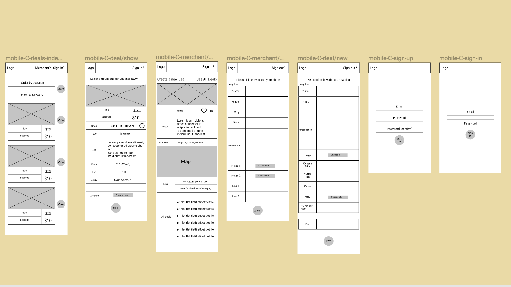

# Nowcher
### A two-sided marketplace project (Term 2/Coder academy Fast track in Melbourne)

Links:  
Website  https://nowcher.herokuapp.com/ 
Github https://github.com/shunichiroid/ca-2smp 

## Overview
Nowcher is Web application providing online discount food vouchers instead of distributing paper one on the street. Restaurant owners can upload vouchers can be used in their shop on the app and general users (potential customers) can get it. General user bring it with mobile phone and use it over the counter. 

### Problem
One of the most common difficulty for restaurants is to obtain stable number of customers constantly. Although the restaurant that is very busy on every weekends, it sometimes happens that any customers does not show up (I actually experienced when I worked for a restaurant). Inventory management is also important duty since it could directory influence the cost. However, it always bother restaurant owners because their stuff (or theirselves) sometimes order ingredients exceedingly by mistake, or food was not ordered as much as expected. They want to sell them as soon as possible even though their price is lower than usual. -The life of food is short.

### Solution
Discount voucher is a good tool to stimulate customers to visit the restaurant. Furthermore, if restaurant owners can provide it to customers anytime they want by  online, this enable them to attract customers urgently in above situation. 

## Plan

### User stories

 
*link*: [Trello](https://trello.com/b/JJMLgzZP/kanban-for-rails-project) 
*Worked with Chris and Ashley. Thank you guys!

### Flowchart

*link*: [www.draw.io](https://www.draw.io/?state=%7B%22ids%22:%5B%221ZIh9BN_FsOwFn33cxZV1KOVjY4JKHGT_%22%5D,%22action%22:%22open%22,%22userId%22:%22102026534693067203867%22%7D#G1ZIh9BN_FsOwFn33cxZV1KOVjY4JKHGT_)

### ERD

*link*: [DbDesigner.net](https://www.dbdesigner.net/designer/schema/168021)

## Design

### Wireframe
#### Mobile

#### Desktop

*link*: [Figma](https://www.figma.com/file/P9RU1OGTJEXdvhnorQvKmWEj/Rails-project)

### Design
I would like to make the app attractive for young users since they are often interested in oppotunity for getting discouted on meals. Color choice was one of the hardest phase in this project because it need to be match with beautiful food images. Appetite stimulating colours, such as red, yellow, orange, brown, green, are suitable and so I created colour pallets with them. I decided the colour from bread image. 

The name of the Web app 'Nowcher' is combined 'now' with 'voucher' because the most advantage of this app is user(restaurant owner) is able to produce discount vouchers anytime, anywhere in seconds.

#### Mood board

*link*: [Pintrest](https://www.pinterest.com.au/shunichiroi/mood-boardrails_project/)

#### Colour

#### Font

#### Logo

*link*: [Figma](https://www.figma.com/file/P9RU1OGTJEXdvhnorQvKmWEj/Rails-project?node-id=67%3A0)

#### Final design
##### Mobile

##### Desktop

*link*: [Figma](https://www.figma.com/file/P9RU1OGTJEXdvhnorQvKmWEj/Rails-project?node-id=157%3A4010)

### References/Tool
#### Inspitation
[pixabay](https://pixabay.com/)  
[Unsplash](https://unsplash.com/)
#### Color
http://paletton.com/  
https://www.rgbtohex.net/  
Digital Color Meter (Mac)
#### Font
[Google Fonts](https://fonts.google.com/)
#### Others
[Icon8](https://icons8.com/)

## Management with Trello
### Scheduling

### Kanban

## Future development / project improvements
- Seach vouchers by location
- Time expiry on voucher
- The shop location on merchant page
- Comment and rating function on merchant page
- Customer user profile page
- Feedback page and linked in voucher mail
- Limitation of voucher amount
- Voucher notification for users
- Code review with others
